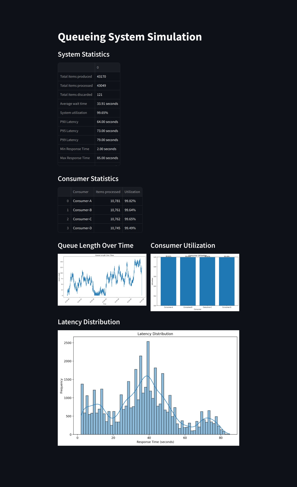

# Queueing Theory

## Getting Started

```bash
poetry install
make run
```

## Preview



## Diagram


## Learning Objectives

- Understand the basic components of a queueing system
- Learn how to use Kendall's notation to describe a queueing system
- Learn how to use Little's Law to analyze a queueing system

## References

[GitHub - joelparkerhenderson/queueing-theory: Queueing theory: an introduction for software development](https://github.com/joelparkerhenderson/queueing-theory/tree/main)
[Queueing Theory - Chapter 1 Introduction - HackMD](https://hackmd.io/kfLYKMjuTY2VaXDuTbsw8Q?view)
[Queueing theory - Wikipedia](https://en.wikipedia.org/wiki/Queueing_theory)

## Keywords

[Kendall's notation - Wikipedia](https://en.wikipedia.org/wiki/Kendall%27s_notation)

## Basic Components of a Queueing System

### Kendall's notation

A/B/C/X/Y/Z

- A: Arrival process
- B: Service process
- C: Number of servers
- X: Capacity of the system
- Y: Queue discipline
- Z: Population size

### Rate

- **Arrival Rate**: New customer arrive
- **Service Rate**: Customers are served
- **Dropout Rate**: Customers leave the queue

### Ratio

- **Utilization Ratio**: Arrival Rate / Service Rate
- **Error Ratio**: Failure Count / Total Count

### Time

- **Lead Time**: From arrival to finish
- **Wait Time**: From arrival to start
- **Service Time**: From start to finish

### Count

- **Total Count**: Total number of customers

### Queueing types

- **First In First Out (FIFO)**
- **Last In First Out (LIFO)**: Stack
- **Priority Queue**
- **Shortest Job First (SJF)**: CPU scheduling
- **Longest Job First (LJF)**: Batch processing
- **Time Sharing**: Multi-user computer systems, each user gets a time slice of CPU time

### Queueing dropouts

- **Balking**: Customers leave the queue before entering
- **Reneging**: Customers leave the queue after entering
- **Jockeying**: Customers change the queue

### Key Performance Indicators (KPIs)

- **Throughput**: Number of items processed per unit of time
- **Delivery Lead Time**: Product teams may say "from concept to customer" or "from idea to implementation"
- **Delivery Service Rate**: Devops teams may say "deployment frequency" or "we ship X times per day"
- **Delivery Error Ratio**: Quality teams may say "change fail rate" or "percentage of rollbacks"
- **Restore Lead Time**: Site reliability engineers may say "time to restore service" or "mean time to restore (MTTR)"
